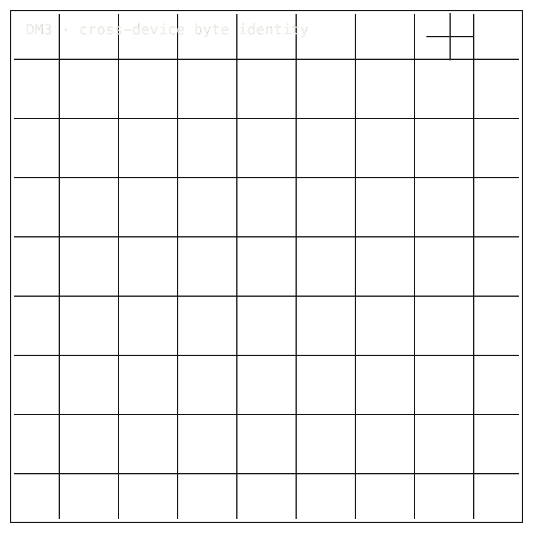

# DM3

## Package Install

Installable package: `python3.11 -m pip install zpe-dm3`.
Current release: `0.1.0` on [PyPI](https://pypi.org/project/zpe-dm3/).
Source: [Zer0pa/DM3](https://github.com/Zer0pa/DM3/).

```bash
python3.11 -m pip install zpe-dm3
```

For full install, smoke, source, and developer commands, [click here](#install-developer-commands-detailed).

---

<table width="100%">
<tr>
<td width="100%" valign="top">
<div><span><b>00 · DM3</b> · COMPUTATION</span> <span>RESEARCH-READY · R8 OPEN</span></div>
      <h1>Deterministic <span>Geometric Computation</span></h1>
      <p>When two phones run the same code, the numbers should match — DM3 · github.com/Zer0pa/DM3</p>
      <p>Every AI app on a phone depends on the chip doing the same thing each time, but almost no one checks. Two phones can run the same model and quietly return different numbers, and the gap stays invisible. DM3 fixes a small computation in place — one binary, one 380-vertex graph — and runs it on two physically distinct Android ARM64 phones. At five measured steps, both phones return identical bytes. Seven of eight reconstruction checks close. The eighth is still open, and other chips are out of scope.</p>
</td>
</tr>
</table>

<table width="100%">
<tr>
<td width="100%" valign="top">
<figure>
        <div></div>
        <figcaption><b>Scope:</b> same binary, two Android ARM64 phones, five measured steps byte-identical; R8 reconstruction remains open.</figcaption>
      </figure>
</td>
</tr>
</table>

<table width="100%">
<tr>
<td width="100%" valign="top">
<div><b>01 · THE GAP</b> <span>NO RECEIPT</span></div>
      <h2>Two phones, same computation, different chips — and nobody checks whether the numbers actually match.</h2>
</td>
</tr>
</table>

<table width="100%">
<tr>
<td width="100%" valign="top">
<div><b>02 · MARKETS</b> <span>ADJACENT FORECASTS</span></div>
      <div>
        <div>
          <div><span>Edge AI software ’30</span>  <span>$66.5B</span></div>
          <div><span>Mobile AI chipset ’30</span>  <span>$84.8B</span></div>
          <div><span>On-device AI ’31</span>  <span>$173.5B</span></div>
          <div><span>Verification software ’30</span>  <span>$15.7B</span></div>
          <div><span>Digital trust tooling ’30</span>  <span>$41.8B</span></div>
        </div>
      </div>
      <div>Five neighbouring markets, one unmeasured assumption: phones that quietly disagree on the same calculation, and nobody priced the cost.</div>
</td>
</tr>
</table>

<table width="100%">
<tr>
<td width="50%" valign="top">
<div><b>03 · VALUE OF MARKET</b></div>
      <div><span>$173.5</span> <span>B</span></div>
      <div>The 2031 on-device AI market — built on a chip-level sameness <b>nobody has been checking</b>.</div>
</td>
<td width="50%" valign="top">
<div><b>04 · INSIGHT</b></div>
      <h2>Same task. Same chip family. <span>Same bytes.</span></h2>
</td>
</tr>
</table>

<table width="100%">
<tr>
<td width="50%" valign="top">
<div><b>05.1 · CURRENT TECH</b> <span>NO RECEIPT TO CHECK</span></div>
        <p>Two phones run the same model and return slightly different numbers. The gap gets blamed on chips, on rounding, on luck — and then it gets shipped. Nobody can point at the step where the two phones first disagreed.</p>
</td>
<td width="50%" valign="top">
<div><b>05.2 · OUR TECH</b> <span>BYTE-EXACT REPLAY</span></div>
        <p>DM3 pins a small computation — one Android binary, one 380-vertex graph, twelve callable task modes — and runs it on two physically distinct ARM64 phones, a RealMe RM10 on native Android and an Apple M1 on an Android emulator. At <strong>five measured steps</strong>, both phones return <strong>identical bytes</strong>. A mismatch would have a step number, not a shrug.</p>
</td>
</tr>
</table>

<table width="100%">
<tr>
<td width="100%" valign="top">
<div><b>05.3 · BENCHMARKS</b> <span>CHECKED PACKET 2026-04-22</span></div>
      <div>
        <div>
          <div><span>Steps</span><b>5/5</b><small>matches</small></div>
          <div><span>Scope</span><b>ARM64</b><small>only</small></div>
          <div><span>Devices</span><b>RM10</b><small>vs M1 AVD</small></div>
          <div><span>Checked</span><b>2026</b><small>04-22</small></div>
        </div>
        <div>
          <div><span>ARM64</span>  <span>5/5 MATCH</span></div>
          <div><span>Sigma</span>  <span>3/3 SHAPE</span></div>
          <div><span>R8</span>  <span>OPEN</span></div>
        </div>
      </div>
      <div><b>Scope:</b> ARM64 only, one task configuration, steps {20, 30, 40, 45, 50}; the eighth reconstruction step is still open.</div>
</td>
</tr>
</table>

<table width="100%">
<tr>
<td width="34%" valign="top">
<div><b>06 · MEASUREMENT</b> <span>SHA-256 RECEIPT CHAIN</span></div>
      <h2>When two phones disagree, the disagreement has a step number.</h2>
</td>
<td width="66%" valign="top">
<div><b>06.1 · COMPARATIVE PERFORMANCE · SHA RECEIPT ON STATIC TIER-2</b></div>
      <div>
        <div>
          <div><span>macOS arm64</span>  <span>SHA equal</span></div>
          <div><span>Linux</span>  <span>SHA equal</span></div>
          <div><span>arm64-qemu</span>  <span>SHA equal</span></div>
          <div><span>x86 native</span>  <span>not measured</span></div>
        </div>
      </div>
      <div>Checked 2026-04-22. A RealMe RM10 on native Android and an Apple M1 Android ARM64 emulator return identical hashes at steps 20, 30, 40, 45, and 50. Three ARM64 platforms confirm; Intel chips were out of scope and are not claimed.</div>
</td>
</tr>
</table>

<table width="100%">
<tr>
<td width="100%" valign="top">
<div><b>07 · KEY METRICS</b> <span>DM3 CHECKED PACK</span></div>
</td>
</tr>
</table>

<table width="100%">
<tr>
<td width="100%" valign="top">
<div><b>07.1 · ARM64 MATCH</b></div>
      <div>5<span>/5</span></div>
      <div>Identical-byte steps &middot; <b>two physically distinct phones</b></div>
</td>
</tr>
</table>

<table width="100%">
<tr>
<td width="100%" valign="top">
<div><b>07.2 · SIGMA SHAPE</b></div>
      <div>3<span>/3</span></div>
      <div>Three ARM64 platforms agree &middot; <b>on every step's trajectory</b></div>
</td>
</tr>
</table>

<table width="100%">
<tr>
<td width="100%" valign="top">
<div><b>07.3 · CALLABLE TASKS</b></div>
      <div>12</div>
      <div>Distinct tasks the fixed binary will run &middot; <b>on demand</b></div>
</td>
</tr>
</table>

<table width="100%">
<tr>
<td width="100%" valign="top">
<div><b>07.4 · STATE DIMENSION</b></div>
      <div>72,960<span>D</span></div>
      <div>Floating-point numbers compared &middot; <b>per step, per phone</b></div>
</td>
</tr>
</table>

<table width="100%">
<tr>
<td width="100%" valign="top">
<div><b>07.5 · RECONSTRUCTION</b></div>
      <div>7<span>/8</span></div>
      <div>Reconstruction checks closed &middot; <b>the eighth still open</b></div>
</td>
</tr>
</table>

<table width="100%">
<tr>
<td width="100%" valign="top">
<div><b>08 · DETERMINISM</b> <span>SHA-PROVEN ARM64</span></div>
      <h2>Two phones. Same bytes. <span>A hash decides.</span></h2>
</td>
</tr>
</table>

<table width="100%">
<tr>
<td width="66%" valign="top">
<div><b>08.1 · WHAT DETERMINISTIC MEANS</b> <span>BYTE-EXACT TRAJECTORY</span></div>
      <p>At every measured step, the same geometric computation produces identical 64-bit floats on two physically distinct ARM64 phones — a RealMe RM10 on native Android and an Apple M1 Android ARM64 emulator. The cryptographic hash over the trajectory matches at steps 20, 30, 40, 45, and 50.</p>
      <p>Determinism here means byte-identical, not approximately equal. The scope is one task configuration on Android ARM64. DM3 does not claim Intel CPU, GPU, or neural-accelerator parity. The check is reproducible, narrow, and dated.</p>
</td>
<td width="34%" valign="top">
<div><b>08.2 · THE HONEST BLOCKER</b></div>
      <span>Honest Blocker &middot;</span>
      <p><strong>R8, the eighth reconstruction step, is still open.</strong> The packet is scoped to 2026-04-22, and four later evaluation cells (G.3, G.4, G.5, G.7) have no promoted outcomes. ARM64 agreement does not imply Intel, GPU, or accelerator agreement. DM3 is a diagnostic, not a framework. Independent source-code provenance for the binary is not yet attestable.</p>
</td>
</tr>
</table>

<table width="100%">
<tr>
<td width="33%" valign="top">
<div><b>09</b> </div>
      <h2>WHEN PHONES STOP <span>QUIETLY DISAGREEING.</span></h2>
</td>
<td width="67%" valign="top">
<div><b>09.1 · THE AMBITION</b></div>
      <p>A mobile AI app should compute the same answer on every phone it runs on. Today that is a wish; DM3 narrows the wish to one fixed binary and one fixed graph so the answer can be tested. Once two phones agree to the byte, sameness becomes something a buyer can require.</p>
</td>
</tr>
</table>

<table width="100%">
<tr>
<td width="33%" valign="top">
<div><b>09.2 · WHAT WORKS NOW</b></div>
        <h2>What holds today: two ARM64 phones return identical bytes at five measured steps; seven of eight reconstruction checks close.</h2>
</td>
<td width="67%" valign="top">
<div><b>09.3 · WHAT'S STILL OPEN</b></div>
        <h2>Still open: the eighth reconstruction step, Intel and GPU parity, source-code provenance, and four later evaluation cells.</h2>
</td>
</tr>
</table>

<table width="100%">
<tr>
<td width="100%" valign="top">
<div><b>09.4</b> &middot; DEBUGGING · NEAR-TERM (12–24 MO)</div>
      <div>A mobile bug stops being folklore</div><div>A mobile engineer staring at two phones that disagree on the same model output can now point at the exact step where they diverged. The argument with the chip vendor moves from "it feels off" to a numbered cell.</div>
</td>
</tr>
</table>

<table width="100%">
<tr>
<td width="100%" valign="top">
<div><b>09.5</b> &middot; PROCUREMENT · NEAR-TERM (12–24 MO)</div>
      <div>A device buyer can require sameness</div><div>An enterprise procurement team specifying a fleet of ARM64 phones for inspectors, medics, or field auditors can write the same-bytes requirement into the purchase order. Acceptance testing has a number to pass, not a vendor narrative to trust.</div>
</td>
</tr>
</table>

<table width="100%">
<tr>
<td width="100%" valign="top">
<div><b>09.6</b> &middot; CERTIFICATION · MID-TERM (24–48 MO)</div>
      <div>Mobile AI claims gain a unit</div><div>A regulator reviewing an AI-powered medical or safety app on a phone gets a primitive to ask for: does this computation match across the certified device class? Without it, every claim about "the model" is a claim about an unbounded number of devices.</div>
</td>
</tr>
</table>

<table width="100%">
<tr>
<td width="100%" valign="top">
<div><b>09.7</b> &middot; STANDARDS · MID-TERM (24–48 MO)</div>
      <div>Industry benchmarks gain a floor</div><div>A mobile-AI benchmark consortium that adopts a fixed-binary, fixed-graph cross-device check stops publishing leaderboards where the same model scores differently per chip without explanation. Comparative results recover their meaning.</div>
</td>
</tr>
</table>

<table width="100%">
<tr>
<td width="100%" valign="top">
<div><b>09.8</b> &middot; METROLOGY · PARADIGM (48 MO+)</div>
      <div>Computation joins the measured world</div><div>A computation that any independent lab can rerun and get the identical bytes back is closer to a kilogram than to a screenshot. Over time, courts, auditors, and scientific reviewers can point at a retained execution event the way they point at a sample on a scale.</div>
</td>
</tr>
</table>

---

<a id="install-developer-commands-detailed"></a>

## Install / Developer Commands Detailed

<!-- INSTALL-DX:START -->
#### Package Install

Installable package: `python3.11 -m pip install zpe-dm3`.
Current release: `0.1.0` on [PyPI](https://pypi.org/project/zpe-dm3/).
Source: [Zer0pa/DM3](https://github.com/Zer0pa/DM3/).

```bash
python3.11 -m pip install zpe-dm3
```

Import smoke:

```bash
python3.11 - <<'PY'
import importlib.metadata as md
import zpe_dm3

print("zpe-dm3", md.version("zpe-dm3"))
PY
```


CLI smoke:

```bash
zpe-dm3 --help
```

Install success only proves package acquisition/import. Product scope, stale PyPI state, platform limits, and blockers remain in the front-door sections below.<!-- INSTALL-DX:END -->

#### Quick Start

```bash
python3 -m venv .venv
source .venv/bin/activate
pip install --upgrade pip
pip install -e .[dev]
python -m zpe_dm3 surface
python -m zpe_dm3 check
pytest -q
```
